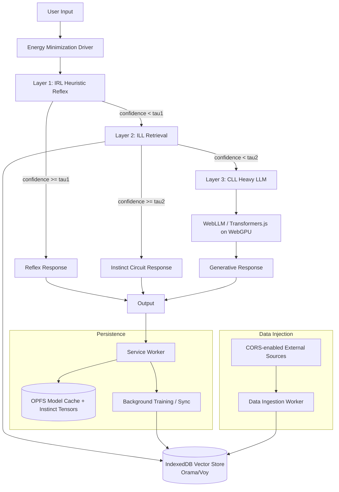

# IAI WebGPU Local-First Blueprint

This blueprint describes a browser-native implementation of the Instinctive Artificial Intelligence (IAI) stack with zero API dependency after first model download.

## Architecture Diagram (Mermaid)

## Layer Semantics

- **Layer 1 (IRL):** fast regex/heuristic checks + lightweight confidence score.
- **Layer 2 (ILL):** local vector retrieval against instinct circuits in IndexedDB.
- **Layer 3 (CLL):** heavy model inference (WebGPU) only when earlier layers fail confidence thresholds.

## Runtime Components

- `iai-kernel.js`: orchestrates the energy-aware handoff between IRL/ILL/CLL.
- `service-worker.js`: keeps model/runtime state persistent and manages background jobs.
- `opfs-store.js`: handles OPFS initialization + high-speed file access.
- `data-ingestion-worker.js`: fetches external data and injects embeddings/documents into Layer 2.
- `main.js`: UI thread integration and 60fps-safe messaging with workers.

## 60fps Responsiveness Guidelines

- Keep all heavy work off main thread (Service Worker + Web Workers).
- Batch ingestion and embedding jobs in small chunks (`requestIdleCallback` or timed slices).
- Stream partial tokens from CLL to UI rather than blocking full response.
- Prefer IRL/ILL first; CLL only under threshold (`tau`).

## Offline-Ready Strategy

1. First run downloads model weights once.
2. Persist weights and updated instinct tensors to OPFS.
3. Cache app shell + scripts in Service Worker cache.
4. Resume from local OPFS + IndexedDB on subsequent loads.

